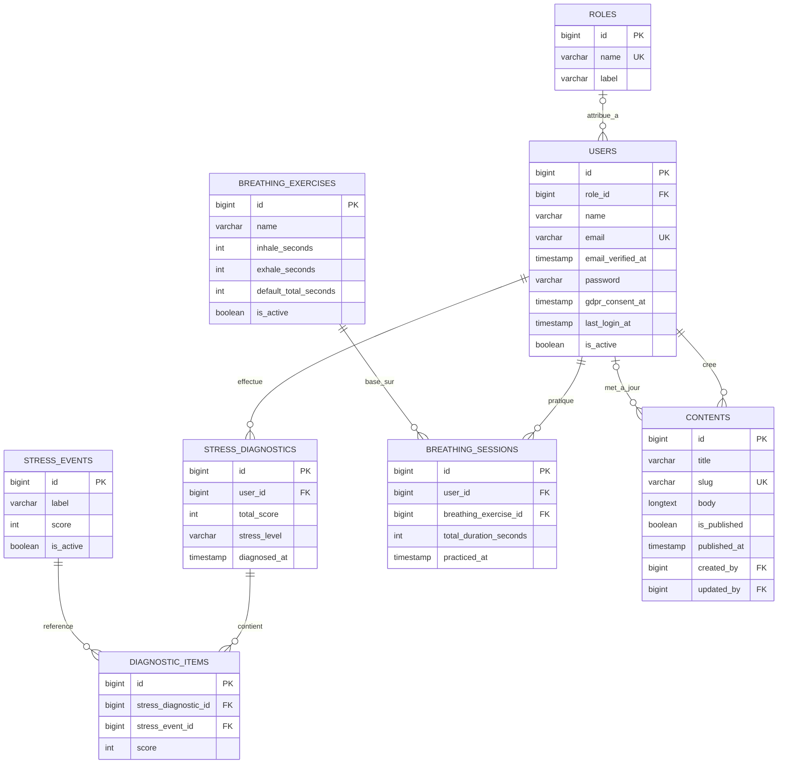

# Livrable Projet - CESIZen

## 1. Informations generales

- Projet: CESIZen
- Type: Application web de prevention et suivi du stress
- Stack principale: Laravel 12 (PHP 8.2), Blade, Tailwind CSS, Alpine.js, Vite
- Date: 21/03/2026
- Version livrable: v1.0

## 2. Contexte et objectifs

CESIZen est une application qui aide les utilisateurs a:

- Evaluer leur niveau de stress via un diagnostic base sur l'echelle Holmes-Rahe.
- Consulter des contenus d'information sur le bien-etre.
- Pratiquer la respiration guidee.
- Suivre l'historique des diagnostics et des sessions de respiration.

Objectif metier principal: offrir un parcours simple de prevention (informer, evaluer, agir, suivre).

## 3. Perimetre fonctionnel livre

### 3.1 Parcours public

- Consultation de la liste des contenus publies.
- Consultation du detail d'un contenu.
- Realisation du diagnostic de stress sans compte (resultat non persiste).
- Acces a la page de respiration guidee.

### 3.2 Parcours utilisateur authentifie

- Inscription et connexion.
- Acces au tableau de bord personnel.
- Realisation du diagnostic avec enregistrement en base.
- Consultation de l'historique des diagnostics.
- Enregistrement automatique des sessions de respiration effectuees.
- Gestion du profil utilisateur.

### 3.3 Parcours administrateur

- Gestion des utilisateurs (activation/desactivation, role).
- Gestion des contenus informationnels (CRUD + publication).
- Gestion des evenements/questionnaire de stress (CRUD).

## 4. Architecture technique

### 4.1 Backend

- Framework: Laravel 12
- Langage: PHP 8.2
- ORM: Eloquent
- Routage: routes web + auth
- Validation: Request validation Laravel
- Autorisation: Gates et Policies

### 4.2 Frontend

- Moteur de rendu: Blade
- Style: Tailwind CSS
- Interactions: Alpine.js
- Bundler: Vite

### 4.3 Base de donnees

Entites principales:

- roles
- users
- contents
- stress_events
- stress_diagnostics
- diagnostic_items
- breathing_exercises
- breathing_sessions

### 4.4 MLD (Merise)

Notes:

- La table `contents` ne contient plus `category` ni `excerpt` (migration de suppression appliquee).
- `diagnostic_items` impose l'unicite du couple (`stress_diagnostic_id`, `stress_event_id`).

## 5. Fonctionnement metier cle

### 5.1 Diagnostic de stress

- L'utilisateur selectionne des evenements de vie vecus.
- Le score total est calcule par somme des scores associes.
- Niveau de stress determine:
  - 0 a 149: faible
  - 150 a 299: modere
  - 300 et plus: eleve
- Si utilisateur connecte: resultat persiste (diagnostic + items).

### 5.2 Respiration guidee

- Exercice actif charge depuis la base.
- Timer guide avec phases inspiration/expiration.
- En fin de seance, si utilisateur connecte, creation d'une session en base.

### 5.3 Tableau de bord

- Affiche le dernier niveau de stress.
- Affiche une recommandation de respiration si stress eleve.
- Affiche les derniers contenus publies.

## 6. Securite et conformite

- Authentification via Laravel Breeze.
- Controle d'acces admin par role + gate access-admin-panel.
- Policies pour users et contents.
- Politique mot de passe forte:
  - minimum 12 caracteres
  - majuscule + minuscule
  - chiffre
  - symbole
- Limitation de tentatives de connexion (rate limiting).
- Blocage des comptes inactifs a la connexion.
- Consentement RGPD stocke (gdpr_consent_at).
- Derniere connexion stockee (last_login_at).

## 7. Donnees d'initialisation (seeders)

- Roles: user, admin
- Evenements de stress (liste Holmes-Rahe)
- Exercice respiration guidee 4-4
- Comptes de test:
  - admin@cesizen.local
  - test@example.com

## 8. Qualite et tests

Des tests fonctionnels automatises sont presents pour couvrir:

- Droits d'acces admin.
- Enregistrement des sessions de respiration.
- Diagnostic de stress (guest et utilisateur connecte).
- Gestion du profil.

Commande standard:

- php artisan test

## 9. Installation et execution

### 9.1 Prerequis

- PHP 8.2+
- Composer
- Node.js + npm
- Base de donnees compatible Laravel

### 9.2 Setup rapide

1. Installer les dependances PHP:
   - composer install
2. Creer le .env:
   - copy .env.example .env
3. Generer la cle app:
   - php artisan key:generate
4. Lancer migrations + seed:
   - php artisan migrate --seed
5. Installer front:
   - npm install
6. Lancer en dev:
   - composer run dev

## 10. Limites connues et pistes d'amelioration

- Ajouter des tests supplementaires sur les vues admin (CRUD detaille).
- Ajouter des indicateurs analytiques (tendances stress par periode).
- Prevoir export PDF des historiques utilisateur.
- Renforcer observabilite (logs metier structures).

## 11. Conclusion

Le livrable CESIZen version v1.0 couvre un parcours complet de prevention du stress:

- Information
- Diagnostic
- Action (respiration)
- Suivi

L'application est exploitable en environnement de demonstration et constitue une base solide pour une mise en production apres durcissement final (monitoring, tests complementaires, procedure de deploiement).